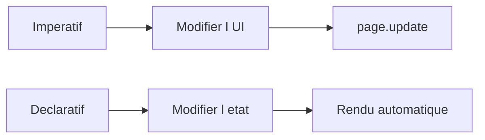

# imerative VS  declarative

## Résumé

IMPERATIF
clic -> je change les widgets -> page.update()

DECLARATIF
clic -> je change l etat -> l UI se reconstruit

## Schéma

```mermaid
flowchart LR
    A[Imperatif] --> B[Modifier l UI]
    B --> C[page.update]

    D[Declaratif] --> E[Modifier l etat]
    E --> F[Rendu automatique]
```