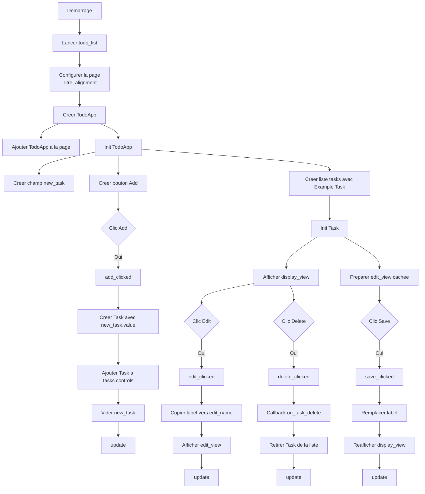

# Organigramme lv06_todo_simple

```mermaid
flowchart TD
    A[Demarrage] --> B[Lancer todo_list]
    B --> C[Configurer la page
          Titre, alignment]
    C --> D[Creer TodoApp]
    D --> E[Ajouter TodoApp a la page]

    D --> F[Init TodoApp]
    F --> G[Creer champ new_task]
    F --> H[Creer liste tasks avec Example Task]
    F --> I[Creer bouton Add]

    I --> J{Clic Add}
    J -->|Oui| K[add_clicked]
    K --> L[Creer Task avec new_task.value]
    L --> M[Ajouter Task a tasks.controls]
    M --> N[Vider new_task]
    N --> O[update]

    H --> P[Init Task]
    P --> Q[Afficher display_view]
    P --> R[Preparer edit_view cachee]

    Q --> S{Clic Edit}
    S -->|Oui| T[edit_clicked]
    T --> U[Copier label vers edit_name]
    U --> V[Afficher edit_view]
    V --> W[update]

    R --> X{Clic Save}
    X -->|Oui| Y[save_clicked]
    Y --> Z[Remplacer label]
    Z --> AA[Reafficher display_view]
    AA --> AB[update]

    Q --> AC{Clic Delete}
    AC -->|Oui| AD[delete_clicked]
    AD --> AE[Callback on_task_delete]
    AE --> AF[Retirer Task de la liste]
    AF --> AG[update]
```
