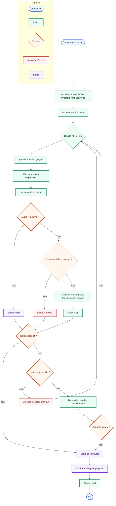

# Organigramme du script password.py

Ce schéma représente le flux actuel de [password.py](password.py).

```mermaid
flowchart TD
    A([Demarrage du script]) --> B[Appeler cls avec le titre Pyperclip for passwords]
    B --> C[Appeler fonction main]
    C --> D{Boucle while True}

    D --> E[Appeler fonction get_pw]
    E --> F[Afficher les sites disponibles]
    F --> G[Lire la saisie utilisateur]

    G --> H{Saisie = q/quit/exit ?}
    H -- Oui --> I[status = quit]
    H -- Non --> J{site present dans pws_dict ?}

    J -- Non --> K[status = invalid]
    J -- Oui --> L[Copier le mot de passe dans le presse-papiers]
    L --> M[status = ok]

    I --> N{status egal quit ?}
    K --> N
    M --> N

    N -- Oui --> O[Sortie de la boucle]
    N -- Non --> P{status egal invalid ?}

    P -- Oui --> Q[Afficher message d'erreur]
    Q --> D

    P -- Non --> R[Demander: another password? y/n]
    R --> S{Reponse egal y ?}

    S -- Oui --> D
    S -- Non --> O

    O --> T[Afficher Exiting the program]
    T --> U[Appeler end]
    U --> V([Fin])

    subgraph Legende
        L1([Debut / Fin])
        L2[Action]
        L3{Decision}
        L4[Message d'erreur]
        L5[Sortie]
    end

    classDef startend fill:#EAF7FF,stroke:#1D4ED8,stroke-width:2px,color:#0B2447;
    classDef action fill:#ECFDF3,stroke:#047857,stroke-width:1.5px,color:#073B2A;
    classDef decision fill:#FFF7ED,stroke:#C2410C,stroke-width:2px,color:#7C2D12;
    classDef error fill:#FEF2F2,stroke:#B91C1C,stroke-width:2px,color:#7F1D1D;
    classDef exit fill:#F5F3FF,stroke:#6D28D9,stroke-width:2px,color:#3B0764;

    class A,V,L1 startend;
    class B,C,D,E,F,G,L,M,R,U,L2 action;
    class H,J,N,P,S,L3 decision;
    class K,Q,L4 error;
    class I,O,T,L5 exit;
```
