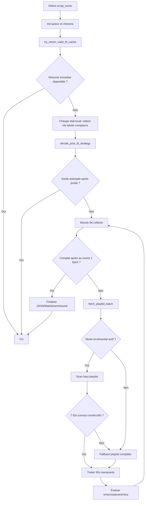

# Organigramme final (simple)

Ce document reflète le flux réel du code refactoré dans `scrap.py`.

## Règles fonctionnelles

1. `try_return_valid_ttl_cache` évite toute requête lourde si le cache TTL est valide et complet.
2. `decide_post_ttl_strategy` décide entre sortie anticipée (dernier ID inchangé) et suite du scraping.
3. `fetch_playlist_batch` encapsule la stratégie incrémentale et son fallback complet.
4. Le mode incrémental ne valide que sur 7 IDs connus consécutifs (`videos` ou `adults`).
5. En cas d'échec du mode incrémental, le fallback complet reste automatique.
6. `resolve_total_playlist_from_batch` centralise le calcul de `total_playlist` + garde-fou de baisse.
7. `remove_stale_adult_ids` nettoie les IDs adults obsolètes de façon dédiée.
8. `handle_no_missing_ids_case` gère explicitement la branche "aucun ID manquant".

## Invariant de lisibilité

1. Une fonction de stratégie = une responsabilité claire.
2. `scrap_some` reste l'orchestrateur, pas l'implémentation détaillée.
3. Chaque bascule de stratégie est explicitement loggée.
