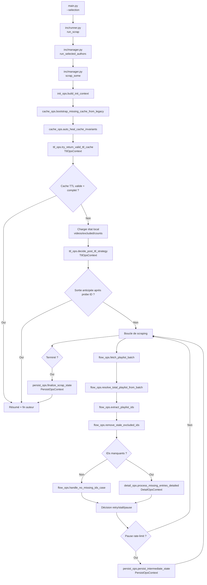

# Organigramme actuel du scraper

Ce document décrit le flux réel en production, après refactor modulaire.

## Vue d'ensemble

## Modules et responsabilités

1. `main.py`

- Parse l'argument `--selection` (`default`, `all`, `N`, `a,b,c`, `range:N`).

1. `inc/runner.py`

- Valide les IDs et route vers `run_selected_authors`.

1. `inc/manager.py`

- Orchestrateur global.
- Initialise le contexte runtime par auteur.
- Construit les contextes dataclass pour les modules ops.
- Pilote la boucle de collecte et la stratégie de reprise.

1. `inc/init_ops.py`

- Construit le contexte d'initialisation (auteur, chemins, paramètres runtime, loader cache TTL).

1. `inc/cache.py`

- Lecture/écriture JSON de cache.
- Compat legacy (`adults`, `adult_count`, `adult_videos`).
- Auto-heal d'invariants.
- Bootstrap depuis anciens fichiers JSON.

1. `inc/flow_ops.py`

- Utilitaires de flux playlist (timeouts, batch, résolution total, scan incrémental, nettoyage IDs exclus).

1. `inc/ttl_ops.py`

- Politique TTL et sortie anticipée.
- Contexte unique: `TtlOpsContext`.

1. `inc/detail_ops.py`

- Traitement détaillé des vidéos manquantes.
- Gestion indisponible/adult/rate-limit.
- Contexte unique: `DetailOpsContext`.

1. `inc/persist_ops.py`

- Sauvegarde intermédiaire (pause/reprise).
- Finalisation JSON + Markdown + résumé.
- Contexte unique: `PersistOpsContext`.

1. `inc/video.py`, `inc/helpers.py`, `inc/render.py`, `inc/constants.py`

- Briques utilitaires spécialisées (métadonnées vidéo, classification erreurs, rendu, constantes yt-dlp).

## Invariants métier

1. Un cache TTL n'est accepté que s'il est valide et complet.
1. Les vidéos indisponibles/private ne sont pas classées adult.
1. `excluded_count` et `excluded_ids` restent cohérents à chaque persistance.
1. Le markdown est régénéré uniquement si nécessaire (fichier absent ou état modifié).
1. Le mode incrémental fallback automatiquement vers scan complet si signal insuffisant.

## Points de robustesse

1. Fallback locale non bloquant (`locale.setlocale`).
1. Garde-fous timeout réseau et timeout global playlist.
1. Détection de stall avec abandon contrôlé après plusieurs passes sans progression.
1. Journalisation explicite des bascules de stratégie (TTL, incrémental, fallback, pause).
