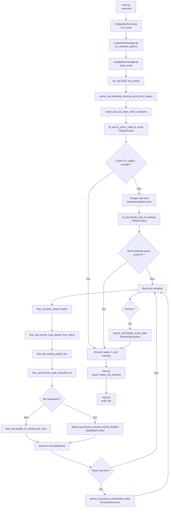

# Organigramme actuel du scraper

Ce document décrit le flux reel en production (scrap + tracking + regeneration BPL).

## Vue d'ensemble

## Modules et responsabilites

1. `main.py`

- Parse `--selection` (`default`, `all`, `N`, `a,b,c`, `range:N`).
- Applique la selection par defaut BPL (`get_default_target_scrape_ids`).
- Lance le scrap puis synchronise `BPL.md` via `import_states_into_tracking` + `build_bpl`.

1. `inc/pipeline/runner.py`

- Valide les IDs et route vers `run_selected_authors`.

1. `inc/pipeline/manager.py`

- Orchestrateur global par auteur.
- Initialise le contexte runtime.
- Construit `TtlOpsContext`, `DetailOpsContext`, `PersistOpsContext`.
- Pilote la boucle de collecte, la gestion des erreurs et le stall control.
- Synchronise le tracking sqlite en fin de flux (TTL/early/final).

1. `inc/pipeline/init_ops.py`

- Construit le contexte d'initialisation (auteur, chemins, seuils runtime, loader cache TTL).

1. `inc/storage/cache.py`

- Lecture/ecriture JSON de cache.
- Compat legacy (`adults`, `adult_count`, `adult_videos`).
- Auto-heal d'invariants et bootstrap depuis anciens JSON.

1. `inc/pipeline/ttl_ops.py`

- Politique TTL et sortie anticipee.
- Probe ultra-legere du dernier ID publie.

1. `inc/pipeline/flow_ops.py`

- Recuperation playlist (timeouts, incremental/full fallback).
- Resolution `total_playlist` avec garde-fou de baisse.
- Extraction IDs, nettoyage `excluded_ids`, gestion du cas sans IDs manquants.

1. `inc/pipeline/detail_ops.py`

- Traitement detaille des videos manquantes.
- Gestion age-restricted, indisponible/private, fallback Android, rate-limit.

1. `inc/pipeline/persist_ops.py`

- Persistance intermediaire en pause (`persist_intermediate_state`).
- Finalisation JSON + Markdown + resume (`finalize_scrap_state`).

1. `inc/reporting/build_bpl.py` et `inc/tracking/tracking_store.py`

- Consolidation des etats vus/non vus dans `tracking.sqlite3`.
- Regeneration de `BPL.md` apres le run principal.

1. `inc/utils/video.py`, `inc/utils/helpers.py`, `inc/reporting/render.py`, `inc/config/constants.py`

- Briques utilitaires (normalisation metadonnees, classification erreurs, rendu Markdown, constantes yt-dlp).

## Invariants metier

1. Un cache TTL n'est accepte que s'il est valide (`cache_valid`) et complet.
1. Les videos indisponibles/private ne sont pas classees adult.
1. `excluded_count` et `excluded_ids` restent coherents a chaque persistance.
1. Le Markdown est regenere uniquement si necessaire (fichier absent ou etat final modifie).
1. Le mode incremental fallback automatiquement vers scan complet si signal insuffisant.

## Points de robustesse

1. Fallback locale non bloquant (`locale.setlocale`).
1. Timeout reseau par inactivite + garde-fou global playlist.
1. Detection de stall avec abandon controle apres plusieurs passes sans progression.
1. Journalisation explicite des bascules de strategie (TTL, probe, incremental, fallback, pause).
