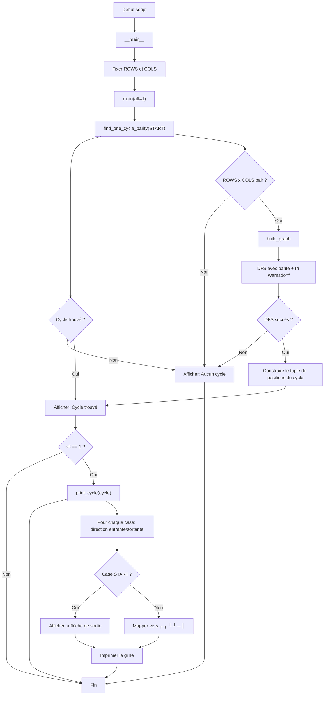

# Organigramme final (simple)

Ce document reflète le flux réel du script `2_4_bth_parity_coins.py` (sans `pymox`, `cls()` et `end()`).

```mermaid
flowchart TD
    A["Début script"] --> B["__main__"]
    B --> C["Fixer ROWS et COLS"]
    C --> D["main(aff=1)"]

    D --> E["find_one_cycle_parity(START)"]
    E --> F{"Cycle trouvé ?"}
    F -- "Non" --> G["Afficher: Aucun cycle"]
    G --> Z["Fin"]

    F -- "Oui" --> H["Afficher: Cycle trouvé"]
    H --> I{"aff == 1 ?"}
    I -- "Non" --> Z
    I -- "Oui" --> J["print_cycle(cycle)"]
    J --> Z

    E --> K{"ROWS x COLS pair ?"}
    K -- "Non" --> G
    K -- "Oui" --> L["build_graph"]
    L --> M["DFS avec parité + tri Warnsdorff"]
    M --> N{"DFS succès ?"}
    N -- "Non" --> G
    N -- "Oui" --> O["Construire le tuple de positions du cycle"]
    O --> H

    J --> P["Pour chaque case: direction entrante/sortante"]
    P --> Q{"Case START ?"}
    Q -- "Oui" --> R["Afficher la flèche de sortie"]
    Q -- "Non" --> S["Mapper vers ┌ ┐ └ ┘ ─ │"]
    R --> T["Imprimer la grille"]
    S --> T
    T --> Z
```
