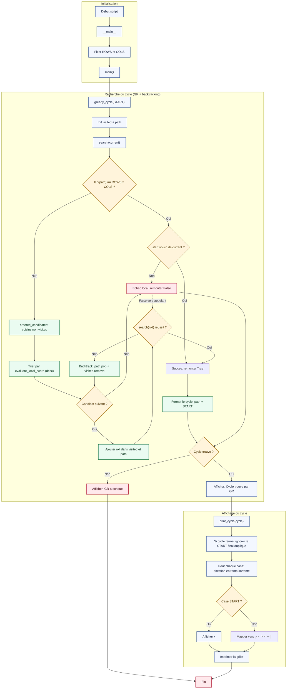

# Organigramme final (simple)

Ce document reflète le flux reel du script `3_1_gr.py` (sans `pymox`, `cls()` et `end()`).

```mermaid
flowchart TD
    %% ----- Sections -----
    subgraph S1["Initialisation"]
        A["Debut script"] --> B["__main__"]
        B --> C["Fixer ROWS et COLS"]
        C --> D["main()"]
    end

    subgraph S2["Recherche du cycle (GR + backtracking)"]
        E["greedy_cycle(START)"] --> F["Init visited + path"]
        F --> G["search(current)"]

        G --> H{"len(path) == ROWS x COLS ?"}
        H -- "Oui" --> I{"start voisin de current ?"}
        I -- "Oui" --> J["Succes: remonter True"]
        I -- "Non" --> K["Echec local: remonter False"]

        H -- "Non" --> L["ordered_candidates: voisins non visites"]
        L --> M["Trier par evaluate_local_score (desc)"]
        M --> N{"Candidat suivant ?"}

        N -- "Oui" --> O["Ajouter nxt dans visited et path"]
        O --> P{"search(nxt) reussit ?"}
        P -- "Oui" --> J
        P -- "Non" --> Q["Backtrack: path.pop + visited.remove"]
        Q --> N

        N -- "Non" --> K
        K -. "False vers appelant" .-> P

        J --> R["Fermer le cycle: path + START"]
        R --> S{"Cycle trouve ?"}
        K --> S
        S -- "Non" --> T["Afficher: GR a echoue"]
        S -- "Oui" --> U["Afficher: Cycle trouve par GR"]
    end

    subgraph S3["Affichage du cycle"]
        U --> V["print_cycle(cycle)"]
        V --> W["Si cycle ferme: ignorer le START final duplique"]
        W --> X["Pour chaque case: direction entrante/sortante"]
        X --> Y{"Case START ?"}
        Y -- "Oui" --> Y1["Afficher x"]
        Y -- "Non" --> Z1["Mapper vers ┌ ┐ └ ┘ ─ │"]
        Y1 --> Z["Imprimer la grille"]
        Z1 --> Z
    end

    D --> E
    T --> AA["Fin"]
    Z --> AA

    %% ----- Styles -----
    classDef io fill:#f3f7ff,stroke:#3c5a99,stroke-width:1.5px,color:#15203b;
    classDef action fill:#eafbf1,stroke:#1f7a46,stroke-width:1.5px,color:#103a22;
    classDef decision fill:#fff4db,stroke:#9c6500,stroke-width:1.5px,color:#4d3200;
    classDef terminal fill:#ffe9ec,stroke:#b4233c,stroke-width:2px,color:#4a0f1a;

    class A,B,C,D,E,F,G,U,V,W,X,Y1,Z io;
    class L,M,O,Q,R action;
    class H,I,N,P,S,Y decision;
    class T,AA,K terminal;
```
