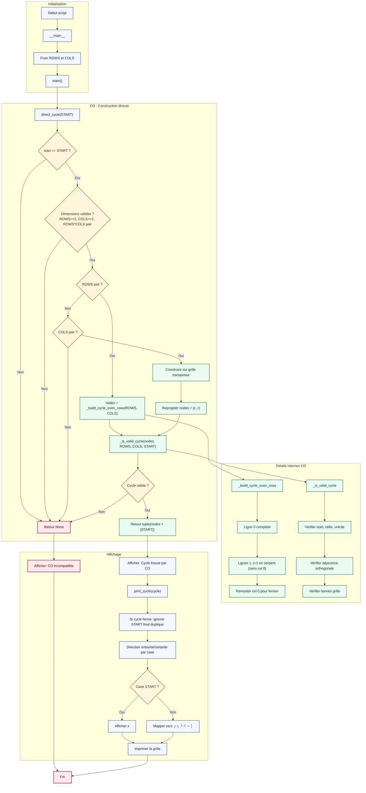

# Organigramme final (simple)

Ce document reflete le flux reel du script `4_1_co.py` (sans `pymox`, `cls()` et `end()`).

```mermaid
flowchart TD
    %% ----- Sections -----
    subgraph S1["Initialisation"]
        A["Debut script"] --> B["__main__"]
        B --> C["Fixer ROWS et COLS"]
        C --> D["main()"]
    end

    subgraph S2["CO : Construction directe"]
        E["direct_cycle(START)"] --> F{"start == START ?"}
        F -- "Non" --> G["Retour None"]
        F -- "Oui" --> H{"Dimensions valides ?\nROWS>=2, COLS>=2, ROWS*COLS pair"}

        H -- "Non" --> G
        H -- "Oui" --> I{"ROWS pair ?"}

        I -- "Oui" --> J["nodes = _build_cycle_even_rows(ROWS, COLS)"]
        I -- "Non" --> K{"COLS pair ?"}
        K -- "Non" --> G
        K -- "Oui" --> L["Construire sur grille transposee"]
        L --> M["Reprojeter nodes = (c, r)"]

        J --> N["_is_valid_cycle(nodes, ROWS, COLS, START)"]
        M --> N
        N --> O{"Cycle valide ?"}
        O -- "Non" --> G
        O -- "Oui" --> P["Retour tuple(nodes + [START])"]
    end

    subgraph S3["Details internes CO"]
        J --> Q["_build_cycle_even_rows"]
        Q --> Q1["Ligne 0 complete"]
        Q1 --> Q2["Lignes 1..n-1 en serpent (sans col 0)"]
        Q2 --> Q3["Remonter col 0 pour fermer"]

        N --> R["_is_valid_cycle"]
        R --> R1["Verifier start, taille, unicite"]
        R1 --> R2["Verifier adjacence orthogonale"]
        R2 --> R3["Verifier bornes grille"]
    end

    subgraph S4["Affichage"]
        D --> E
        P --> S["Afficher: Cycle trouve par CO"]
        G --> T["Afficher: CO incompatible"]
        S --> U["print_cycle(cycle)"]
        U --> V["Si cycle ferme: ignorer START final duplique"]
        V --> W["Direction entrante/sortante par case"]
        W --> X{"Case START ?"}
        X -- "Oui" --> Y["Afficher x"]
        X -- "Non" --> Z["Mapper vers ┌ ┐ └ ┘ ─ │"]
        Y --> AA["Imprimer la grille"]
        Z --> AA
    end

    T --> AB["Fin"]
    AA --> AB

    %% ----- Styles -----
    classDef io fill:#f3f7ff,stroke:#3c5a99,stroke-width:1.5px,color:#15203b;
    classDef action fill:#eafbf1,stroke:#1f7a46,stroke-width:1.5px,color:#103a22;
    classDef decision fill:#fff4db,stroke:#9c6500,stroke-width:1.5px,color:#4d3200;
    classDef terminal fill:#ffe9ec,stroke:#b4233c,stroke-width:2px,color:#4a0f1a;

    class A,B,C,D,E,S,U,V,W,Y,Z,AA io;
    class J,L,M,N,P,Q,Q1,Q2,Q3,R,R1,R2,R3 action;
    class F,H,I,K,O,X decision;
    class G,T,AB terminal;
```
