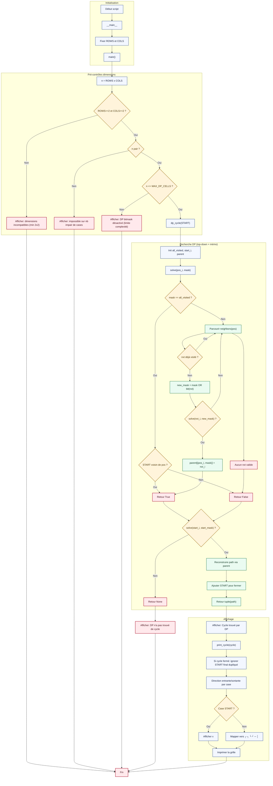

# Organigramme final (simple)

Ce document reflète le flux réel du script `5_1_dp.py` (sans `pymox`, `cls()` et `end()`).

```mermaid
flowchart TD
    %% ----- Sections -----
    subgraph S1["Initialisation"]
        A["Début script"] --> B["__main__"]
        B --> C["Fixer ROWS et COLS"]
        C --> D["main()"]
    end

    subgraph S2["Pré-contrôles dimensions"]
        D --> E["n = ROWS x COLS"]
        E --> F{"ROWS>=2 et COLS>=2 ?"}
        F -- "Non" --> G["Afficher: dimensions incompatibles (min 2x2)"]
        F -- "Oui" --> H{"n pair ?"}
        H -- "Non" --> I["Afficher: impossible sur nb impair de cases"]
        H -- "Oui" --> J{"n <= MAX_DP_CELLS ?"}
        J -- "Non" --> K["Afficher: DP bitmask désactivé (limite complexité)"]
        J -- "Oui" --> L["dp_cycle(START)"]
    end

    subgraph S3["Recherche DP (top-down + mémo)"]
        L --> M["Init all_visited, start_i, parent"]
        M --> N["solve(pos_i, mask)"]

        N --> O{"mask == all_visited ?"}
        O -- "Oui" --> P{"START voisin de pos ?"}
        P -- "Oui" --> Q["Retour True"]
        P -- "Non" --> R["Retour False"]

        O -- "Non" --> S["Parcourir neighbors(pos)"]
        S --> T{"nxt déjà visité ?"}
        T -- "Oui" --> S
        T -- "Non" --> U["new_mask = mask OR bit(nxt)"]
        U --> V{"solve(nxt_i, new_mask) ?"}
        V -- "Oui" --> W["parent[(pos_i, mask)] = nxt_i"]
        W --> Q
        V -- "Non" --> S
        S --> X["Aucun nxt valide"]
        X --> R

        Q --> Y{"solve(start_i, start_mask) ?"}
        R --> Y
        Y -- "Non" --> Z["Retour None"]
        Y -- "Oui" --> AA["Reconstruire path via parent"]
        AA --> AB["Ajouter START pour fermer"]
        AB --> AC["Retour tuple(path)"]
    end

    subgraph S4["Affichage"]
        AC --> AD["Afficher: Cycle trouvé par DP"]
        AD --> AE["print_cycle(cycle)"]
        AE --> AF["Si cycle fermé: ignorer START final dupliqué"]
        AF --> AG["Direction entrante/sortante par case"]
        AG --> AH{"Case START ?"}
        AH -- "Oui" --> AI["Afficher x"]
        AH -- "Non" --> AJ["Mapper vers ┌ ┐ └ ┘ ─ │"]
        AI --> AK["Imprimer la grille"]
        AJ --> AK
    end

    G --> AL["Fin"]
    I --> AL
    K --> AL
    Z --> AM["Afficher: DP n'a pas trouvé de cycle"]
    AM --> AL
    AK --> AL

    %% ----- Styles -----
    classDef io fill:#f3f7ff,stroke:#3c5a99,stroke-width:1.5px,color:#15203b;
    classDef action fill:#eafbf1,stroke:#1f7a46,stroke-width:1.5px,color:#103a22;
    classDef decision fill:#fff4db,stroke:#9c6500,stroke-width:1.5px,color:#4d3200;
    classDef terminal fill:#ffe9ec,stroke:#b4233c,stroke-width:2px,color:#4a0f1a;

    class A,B,C,D,E,L,M,N,AD,AE,AF,AG,AI,AJ,AK io;
    class S,U,W,AA,AB,AC action;
    class F,H,J,O,P,T,V,Y,AH decision;
    class G,I,K,R,Q,X,Z,AM,AL terminal;
```
