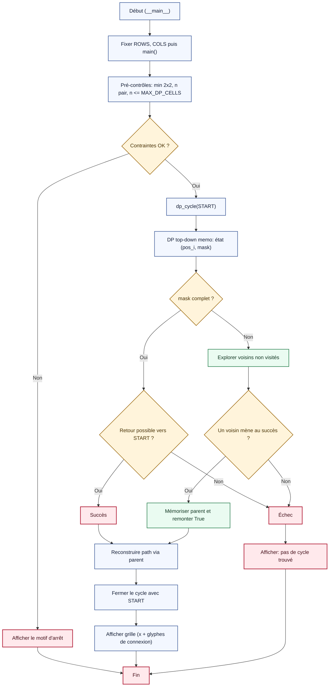

# Organigramme DP (version compacte)

Ce document résume le flux du script `5_1_dp.py` en version simplifiée (sans `pymox`, `cls()` et `end()`).

```mermaid
flowchart TD
    A["Début (__main__)"] --> B["Fixer ROWS, COLS puis main()"]
    B --> C["Pré-contrôles: min 2x2, n pair, n <= MAX_DP_CELLS"]

    C --> D{"Contraintes OK ?"}
    D -- "Non" --> E["Afficher le motif d'arrêt"]
    D -- "Oui" --> F["dp_cycle(START)"]

    F --> G["DP top-down memo: état (pos_i, mask)"]
    G --> H{"mask complet ?"}
    H -- "Oui" --> I{"Retour possible vers START ?"}
    I -- "Oui" --> J["Succès"]
    I -- "Non" --> K["Échec"]

    H -- "Non" --> L["Explorer voisins non visités"]
    L --> M{"Un voisin mène au succès ?"}
    M -- "Oui" --> N["Mémoriser parent et remonter True"]
    M -- "Non" --> K

    J --> O["Reconstruire path via parent"]
    N --> O
    O --> P["Fermer le cycle avec START"]

    P --> Q["Afficher grille (x + glyphes de connexion)"]
    K --> R["Afficher: pas de cycle trouvé"]
    E --> S["Fin"]
    Q --> S
    R --> S

    classDef io fill:#f3f7ff,stroke:#3c5a99,stroke-width:1.5px,color:#15203b;
    classDef action fill:#eafbf1,stroke:#1f7a46,stroke-width:1.5px,color:#103a22;
    classDef decision fill:#fff4db,stroke:#9c6500,stroke-width:1.5px,color:#4d3200;
    classDef terminal fill:#ffe9ec,stroke:#b4233c,stroke-width:2px,color:#4a0f1a;

    class A,B,C,F,G,O,P,Q io;
    class L,N action;
    class D,H,I,M decision;
    class E,J,K,R,S terminal;
```
