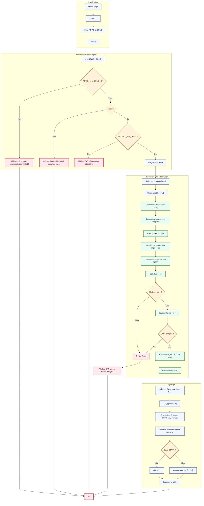

# Organigramme final (simple)

Ce document reflète le flux réel du script `6_1_sat.py` (sans `pymox`, `cls()` et `end()`).

```mermaid
flowchart TD
    %% ----- Sections -----
    subgraph S1["Initialisation"]
        A["Début script"] --> B["__main__"]
        B --> C["Fixer ROWS et COLS"]
        C --> D["main()"]
    end

    subgraph S2["Pré-contrôles dimensions"]
        D --> E["n = ROWS x COLS"]
        E --> F{"ROWS>=2 et COLS>=2 ?"}
        F -- "Non" --> G["Afficher: dimensions incompatibles (min 2x2)"]
        F -- "Oui" --> H{"n pair ?"}
        H -- "Non" --> I["Afficher: impossible sur nb impair de cases"]
        H -- "Oui" --> J{"n <= MAX_SAT_CELLS ?"}
        J -- "Non" --> K["Afficher: SAT pédagogique désactivé"]
        J -- "Oui" --> L["sat_cycle(START)"]
    end

    subgraph S3["Encodage SAT + résolution"]
        L --> M["_build_sat_instance(start)"]
        M --> N["Créer variables x(v,t)"]
        N --> O["Contraintes: exactement-une par t"]
        O --> P["Contraintes: exactement-une par v"]
        P --> Q["Fixer START au pas 0"]
        Q --> R["Interdire transitions non-adjacentes"]
        R --> S["Contraindre fermeture vers START"]
        S --> T["_dpll(clauses, {})"]

        T --> U{"Modèle trouvé ?"}
        U -- "Non" --> V["Retour None"]
        U -- "Oui" --> W["Décoder l'ordre t -> v"]
        W --> X{"Ordre complet ?"}
        X -- "Non" --> V
        X -- "Oui" --> Y["Construire cycle + START final"]
        Y --> Z["Retour tuple(cycle)"]
    end

    subgraph S4["Affichage"]
        Z --> AA["Afficher: Cycle trouvé par SAT"]
        AA --> AB["print_cycle(cycle)"]
        AB --> AC["Si cycle fermé: ignorer START final dupliqué"]
        AC --> AD["Direction entrante/sortante par case"]
        AD --> AE{"Case START ?"}
        AE -- "Oui" --> AF["Afficher x"]
        AE -- "Non" --> AG["Mapper vers ┌ ┐ └ ┘ ─ │"]
        AF --> AH["Imprimer la grille"]
        AG --> AH
    end

    G --> AI["Fin"]
    I --> AI
    K --> AI
    V --> AJ["Afficher: SAT n'a pas trouvé de cycle"]
    AJ --> AI
    AH --> AI

    %% ----- Styles -----
    classDef io fill:#f3f7ff,stroke:#3c5a99,stroke-width:1.5px,color:#15203b;
    classDef action fill:#eafbf1,stroke:#1f7a46,stroke-width:1.5px,color:#103a22;
    classDef decision fill:#fff4db,stroke:#9c6500,stroke-width:1.5px,color:#4d3200;
    classDef terminal fill:#ffe9ec,stroke:#b4233c,stroke-width:2px,color:#4a0f1a;

    class A,B,C,D,E,L,M,N,AA,AB,AC,AD,AF,AG,AH io;
    class O,P,Q,R,S,T,W,Y,Z action;
    class F,H,J,U,X,AE decision;
    class G,I,K,V,AJ,AI terminal;
```
