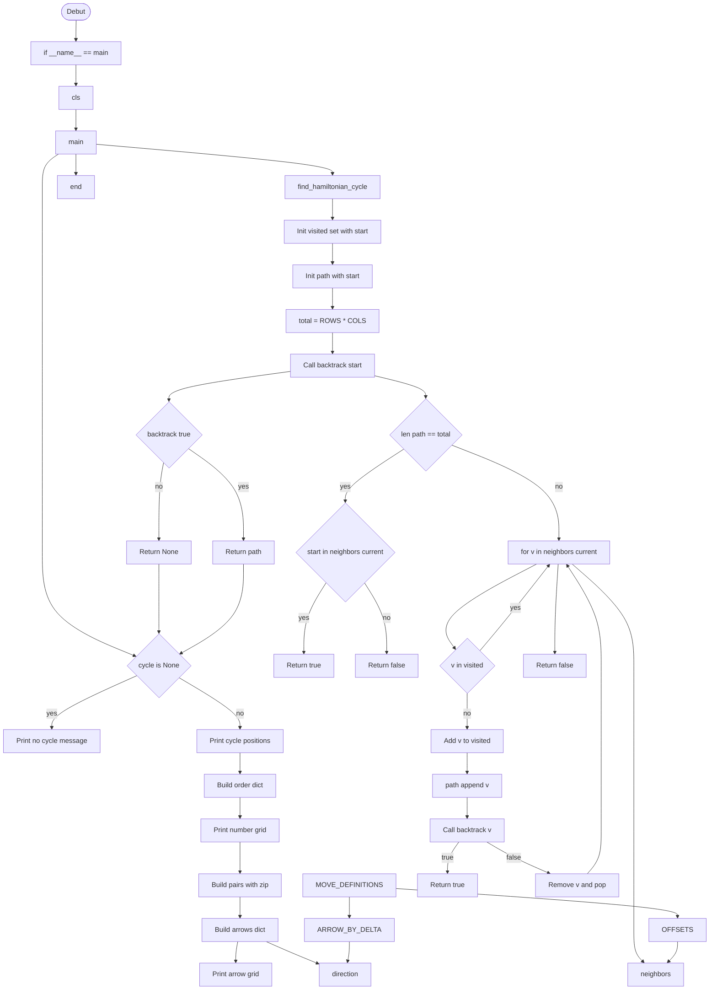

# Palais

Le palais est un carré de taille 4×4, et le robot se trouve au départ dans le coin en bas à gauche.

Votre robot doit passer une et une seule fois dans chacune des pièces, puis se retrouver dans sa case de départ.

À noter: Dans [la résolution initiale - line ~314](..\old_algorea.py), le script ne fait qu'écrire le pathn sans le calculer.

## → 🎯 Ordre optimal pour comprendre les 6 méthodes

1️⃣ BT — BackTracking “pur” (le plus intuitif)

C’est la base de tout.

Tu explores, tu avances, tu te bloques, tu reviens en arrière.

C’est comme résoudre un labyrinthe.

C’est visuel, concret, facile à comprendre.

C’est la fondation sur laquelle reposent les méthodes plus avancées.

👉 On commence par ça, c’est indispensable.

2️⃣ BTH — BackTracking + Heuristiques (la version intelligente)

C’est BT, mais avec des règles qui t’évitent de te coincer.

On choisit les cases “fragiles” d’abord

On évite de créer des zones isolées

On réduit énormément les essais

👉 C’est la version “propre” et efficace du BT.

👉 Très pédagogique, très utile.

3️⃣ GR — Greedy Rexconstruction (rapide, mais pas garanti)

Greedy = Glouton

Ici, tu ne reviens pas en arrière.

Tu choisis toujours le meilleur coup local.

Exemple : aller vers la case qui a le moins de voisins libres.

Très simple

Très rapide

Parfois ça marche tout seul

Parfois ça échoue → on combine avec BT

👉 C’est une étape naturelle après BTH.

4️⃣ CO — Construction directe (méthode mathématique)

Ici, on ne cherche plus :

On construit directement un cycle hamiltonien.

Motifs serpentins

Grilles pair×pair

Transformations (rotations, symétries, décalage du point de départ)

👉 C’est élégant, puissant, mais demande un peu de recul.

👉 C’est ici que notre matrice de référence entre en jeu :

5️⃣ DP — Dynamic Programming (programmation dynamique)

Là, on passe dans le monde des états :
position actuelle

ensemble des cases visitées (bitmask)

C’est très propre, très rigoureux, mais :

ça explose vite

ça demande de comprendre les bitmasks

c’est plus abstrait

👉 On le place en 5ᵉ car il faut déjà être à l’aise avec BT et les heuristiques.

6️⃣ SAT/ILP — Encodage dans un solveur général

Code : SAT = SATisfiability, ILP = Integer Linear Programming

C’est la méthode “ingénieur industriel” :

on encode le problème en logique booléenne (SAT)

ou en contraintes linéaires (ILP)

et un solveur général trouve la solution

C’est puissant, mais :

pas intuitif

pas pédagogique pour commencer demande de comprendre comment encoder un problème

👉 On le garde pour la fin.

---

🧘 Pourquoi BT est fondamental

Parce que :

BTH = BT + intelligence

GR = BT sans retour arrière

DP = BT mais avec mémoire

SAT = BT mais délégué à un solveur

CO = solution trouvée sans BT, mais BT permet de la vérifier

BT est la racine de toutes les autres méthodes.

## 1️⃣ BT — BackTracking “pur” (le plus intuitif)

### Pseudo-code

```bash

    function explore(case, visited, path):
        if toutes les cases sont visitées:
            return case adjacent à A
    
    pour chaque voisin v de case:
        si v non visité:
            visited[v] = vrai
            path.append(v)

            si explore(v, visited, path):
                return vrai

            visited[v] = faux
            path.pop()

    return faux
```

\+ Pédagogique

```bash
def bt(pos, step):
    if step == TOTAL_CELLS:
        if pos == START:   # cycle hamiltonien
            save_solution()
        return

    for nxt in neighbors(pos):
        if not visited[nxt]:
            visited[nxt] = True
            path[step] = nxt
            bt(nxt, step + 1)
            visited[nxt] = False

```

### Diagramm



## 2️⃣ BTH — BackTracking + Heuristiques (la version intelligente)

On garde le BT, mais on choisit mieux les voisins.

### ⭐ Heuristique de Warnsdorff (adaptée aux grilles)

Pour chaque voisin possible

* on calcule le nombre de mouvements possibles depuis ce voisin

* on trie les voisins du plus contraint au moins contraint.

→ on trie les voisins selon leur “degré” (nombre de sorties possibles).

```python
# Version Pédagogique (+ simple)
def degree(pos, visited):
    """Nombre de voisins libres autour de pos."""
    count = 0
    for nxt in neighbors(pos):
        if not visited[nxt]:
            count += 1
    return count

# Version Pythonique (+ typee)
def degree(pos: Pos, visited: Dict[Pos, bool]) -> int:
    """Nombre de voisins libres autour de pos."""
    return sum(1 for v in neighbors(pos) if not visited[v])


def bth(pos, step):
    if step == TOTAL_CELLS:
        if pos == START:
            save_solution()
        return

    # 1) Générer les voisins libres
    moves = [nxt for nxt in neighbors(pos) if not visited[nxt]]

    # 2) Trier selon l’heuristique (Warnsdorff)
    moves.sort(key=lambda v: degree(v, visited))


    # 3) Explorer dans cet ordre
    for nxt in moves:
        visited[nxt] = True
        path[step] = nxt
        bth(nxt, step + 1)
        visited[nxt] = False
```

### 🎯 Les méthodes BTH que tu veux intégrer

Voici la liste officielle, propre, et cohérente :

| Méthode        | Nom complet                  | Description                                                                   |
|----------------|------------------------------|-------------------------------------------------------------------------------|
| **"BTH"**      | Backtracking + Warnsdorff    | Tri par degré simple                                                          |
| **"BTH++"**    | BTH + tie‑breaking           | Tri par degré + critère secondaire                                            |
| **"BTH+++"**   | BTH + tie‑breaking dynamique | Critère secondaire dépendant du step, de la parité, ou de la distance à START |
| **"parity"**   | BTH + filtre de parité       | On élimine les voisins qui violent la parité du chemin                        |
| **"frontier"** | BTH + tie‑breaking frontière | On favorise les cases proches de la frontière                                 |

### ⭐ BTH++ = BTH + tie‑breaking (critère secondaire)

L’idée est simple :

Quand deux voisins ont le même degré, on applique un deuxième critère pour les départager.

Ce deuxième critère peut être :

* la distance à la fin,
* la distance au centre,
* la parité,
* l’ordre fixe (haut, bas, gauche, droite),
* la distance à START,
* la distance à la frontière,
etc.

→ ✔ Tie‑breaking par distance au centre (+ classique)

On favorise les cases plus centrales, car les bords sont plus contraints.

### BTH++ avec tie‑breaking (ordre secondaire) BTH++ avec parité (encore plus rapide) 

## 3️⃣ GR — Greedy Reconstruction

Imagine que tu dois reconstruire un tableau de bits, mais certains bits sont manquants.

BTH ferait :

```python
def BTH_reconstruct(missing_index):
    for possible_value in [0, 1]:
        if constraints_respected(possible_value):
            result = BTH_reconstruct(next_missing)
            if result != FAIL:
                return result
    return FAIL
```

* → il teste toutes les possibilités  
* → il revient en arrière si ça ne marche pas
* → fiable mais lent

GR ferait :

```python
def GR_reconstruct(missing_index):
    value = guess_best_value(missing_index)  # heuristique
    if constraints_respected(value):
        return value
    else:
        return FAIL
```

* → il devine la valeur la plus probable = choisit la meilleure option locale
* → il ne revient jamais en arrière  
* → rapide mais peut se tromper

exemple:

1 1 ? 1 1

GR dit :
“La majorité est 1 → je mets 1.”

BTH dit :
“J’essaie 0 → ça marche pas → j’essaie 1 → ça marche.”

🧩 Pseudo‑code GR pour une grille 4×4
pseudo

```python
function GR_Robot_4x4():

    start = (0, 0)                 # bas gauche
    current = start

    path = [start]
    visited = { start }

    for step in 1..15:             # il reste 15 cases à visiter

        # 1. voisins possibles (haut, bas, gauche, droite)
        neighbors = get_neighbors(current)

        # 2. garder seulement les voisins valides
        candidates = []
        for cell in neighbors:
            if inside_grid(cell) and cell not in visited:
                candidates.append(cell)

        # 3. si aucun voisin → GR échoue
        if candidates is empty:
            return FAIL

        # 4. choisir le meilleur voisin selon une heuristique locale
        best_cell = NONE
        best_score = -∞

        for cell in candidates:
            score = evaluate_local_score(cell, visited)
            if score > best_score:
                best_score = score
                best_cell = cell

        # 5. avancer
        current = best_cell
        visited.add(current)
        path.append(current)

    # 6. vérifier si on peut revenir au départ
    if start in get_neighbors(current):
        path.append(start)
        return path
    else:
        return FAIL
```

🔍 Détail de la fonction de scoring - Heuristique locale (le cœur du “G” de Greedy)
pseudo

```python
function evaluate_local_score(cell, visited):

    score = 0

    # 1. On préfère les cases qui ont peu de voisins libres
    free = count_neighbors_not_visited(cell, visited)
    score -= free                 # moins il y en a, mieux c'est

    # 2. On évite les coins trop tôt
    if cell is a corner:
        score -= 2

    # 3. On favorise les cases qui ne créent pas d'impasse
    if leads_to_dead_end(cell, visited):
        score -= 5

    return score
```

## 4️⃣ CO — Construction directe (méthode mathématique)

 On construit directement un cycle à partir d’un motif global, sans exploration exhaustive.

```python
function CO_cycle():

    path = []

    for row in 0..3:

        if row is even:
            # serpentin vers la droite
            for col in 0..3:
                path.append((row, col))
        else:
            # serpentin vers la gauche
            for col in 3..0:
                path.append((row, col))

    # on ferme le cycle en revenant à START
    path.append((0,0))

    return path
```

## 5️⃣ DP — Dynamic Programming (programmation dynamique)

Ici, on mémorise les sous-problèmes pour éviter de recalculer les mêmes branches.

Un état DP représente :

* la position courante `(r, c)`
* l'ensemble des cases déjà visitées `mask` (bitmask)

Sur une grille 4×4, on numérote les 16 cases de `0` à `15`.

`mask` est un entier binaire où le bit `i` vaut 1 si la case `i` est déjà visitée.

### 🧩 Idée de transition

Depuis un état `(pos, mask)`, on essaie chaque voisin `nxt` non visité :

* `new_mask = mask | (1 << nxt)`
* on continue vers `(nxt, new_mask)`

Cas terminal :

* si `mask` contient toutes les cases, on valide seulement si `pos` est adjacent à `START` (cycle hamiltonien fermé).

### Pseudo-code (DP top-down + mémoïsation)

```python
function DP(pos, mask):

    if mask == ALL_VISITED:
        return START in neighbors(pos)

    if memo[pos][mask] is known:
        return memo[pos][mask]

    for nxt in neighbors(pos):
        if bit(nxt) not in mask:
            if DP(nxt, mask union bit(nxt)):
                parent[(pos, mask)] = nxt
                memo[pos][mask] = True
                return True

    memo[pos][mask] = False
    return False
```

### 📈 Complexité

Nombre d'états : `N * 2^N`

Transitions par état : au plus 4 (grille orthogonale)

Complexité temporelle : `O(4 * N * 2^N)`

Complexité mémoire : `O(N * 2^N)`

Pour `N = 16`, c'est faisable. Pour des grilles bien plus grandes, ça devient vite coûteux.

## 6️⃣ SAT/ILP — Encodage dans un solveur général

Ici, on ne code plus un algorithme de parcours "a la main".

On transforme le probleme en contraintes logiques (SAT) ou lineaires (ILP),
puis on laisse un solveur general trouver une solution.

### 🧠 Idee SAT (variables booleennes)

On definit une variable booleenne `x[v, t]` :

* `x[v, t] = True` signifie : la case `v` est visitee au pas `t`.

Ensuite on ajoute des contraintes :

* chaque pas `t` contient exactement une case,
* chaque case `v` apparait exactement une fois,
* les pas consecutifs doivent etre adjacents,
* le dernier pas doit etre adjacent a `START` (fermeture du cycle),
* on peut fixer `START` au pas 0 pour casser une symetrie.

### 🧱 Idee ILP (variables binaires)

Meme logique, mais avec des variables binaires `x[v, t] in {0,1}` et des equations :

* `sum_v x[v, t] = 1` pour tout `t`
* `sum_t x[v, t] = 1` pour tout `v`
* contraintes d'adjacence entre `t` et `t+1`

Un solveur MILP (par ex. CBC, Gurobi, CPLEX) peut alors chercher une solution faisable.

### Pseudo-code SAT/ILP (vue haut niveau)

```python
function solve_by_solver():
    model = new_model()

    # Variables: x[v,t]
    create_binary_variables(x[v,t])

    # 1) Une case par pas
    for t in steps:
        add_constraint(sum_v x[v,t] == 1)

    # 2) Une visite par case
    for v in cells:
        add_constraint(sum_t x[v,t] == 1)

    # 3) Adjacence
    for t in steps:
        forbid_non_adjacent_pairs_between_t_and_t_plus_1()

    # 4) Fixer START au pas 0
    add_constraint(x[START,0] == 1)

    status = solver.solve(model)
    if status is feasible:
        return decode_cycle_from_x()
    return FAIL
```

### ✅ Avantages / ⚠ Limites

Avantages :

* formulation tres generale,
* robuste,
* facile d'ajouter des contraintes metier.

Limites :

* encodage moins intuitif,
* cout de modelisation,
* performances dependantes du solveur et de l'encodage.

### 📈 Complexite (idee)

Le probleme hamiltonien reste NP-complet.

SAT/ILP ne change pas la nature theorique du probleme,
mais beneficie d'optimisations industrielles tres puissantes en pratique.
